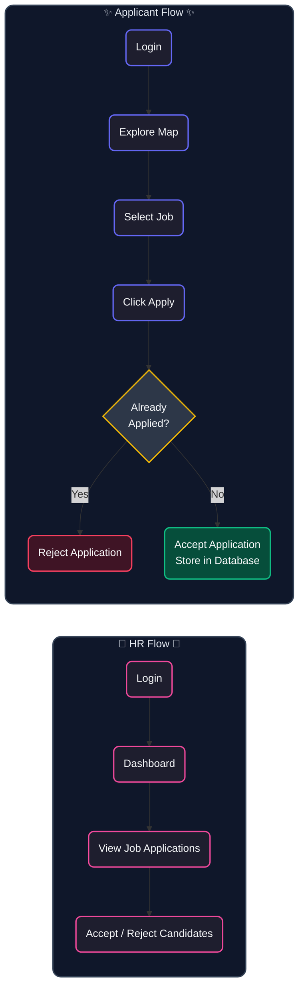

# Job Hiring Platform Workflow

```mermaid
graph TB
    subgraph ApplicantFlow ["✨ Applicant Flow ✨"]
        direction TB
        A1(Login) --> A2(Explore Map)
        A2 --> A3(Select Job)
        A3 --> A4(Click Apply)
        A4 --> A5{Already<br>Applied?}
        A5 -- Yes --> A6(Reject Application)
        A5 -- No --> A7(Accept Application<br>Store in Database)
    end

    subgraph HRFlow ["🏢 HR Flow 🏢"]
        direction TB
        H1(Login) --> H2(Dashboard)
        H2 --> H3(View Job Applications)
        H3 --> H4(Accept / Reject Candidates)
    end

    %% Invisible link to force side-by-side layout in some renderers
    ApplicantFlow ~~~ HRFlow

    %% Professional Dark Theme Styling
    classDef process fill:#1e1e2e,stroke:#6366f1,stroke-width:2px,color:#f8fafc,rx:8px,ry:8px
    classDef decision fill:#2d3748,stroke:#eab308,stroke-width:2px,color:#f8fafc
    classDef reject fill:#3f1425,stroke:#f43f5e,stroke-width:2px,color:#f8fafc,rx:8px,ry:8px
    classDef accept fill:#064e3b,stroke:#10b981,stroke-width:2px,color:#f8fafc,rx:8px,ry:8px
    classDef hrProcess fill:#1e1e2e,stroke:#ec4899,stroke-width:2px,color:#f8fafc,rx:8px,ry:8px

    class A1,A2,A3,A4 process
    class A5 decision
    class A6 reject
    class A7 accept
    class H1,H2,H3,H4 hrProcess

    style ApplicantFlow fill:#0f172a,stroke:#334155,stroke-width:2px,color:#e2e8f0,rx:12px,ry:12px
    style HRFlow fill:#0f172a,stroke:#334155,stroke-width:2px,color:#e2e8f0,rx:12px,ry:12px
```
